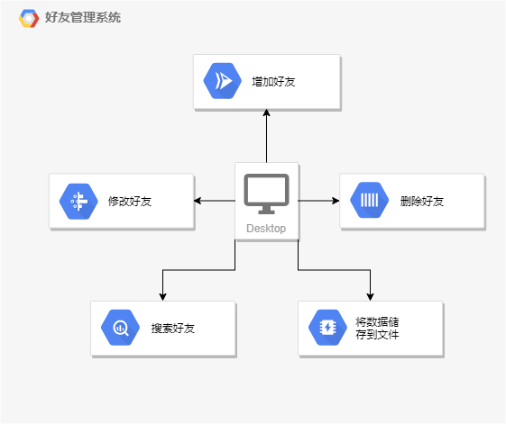

[toc]

# 面向对象分析（OAA）

## 1.功能需求分析

​	随着社会的发展，人与人之间的关系开始变得错综复杂起来，结交的朋友也变得越来越多，可以利用计算机管理好友。

## 2.功能描述

​	好友管理系统可以对多个类别的好友进行查询，如女性好友，男性好友，同龄好友，不同龄好友，一班好友，哥们等。

​	同时提供一下功能：

​	查询：可根据输入条件对好友进行查询。
​	插入：输入好友信息后，写入文件。
​	更改：对指定的好友信息进行更改。
​	删除：对指定的好友进行删除。
​	排序：查询时可根据不同的条件排序。

## 3.功能结构图

