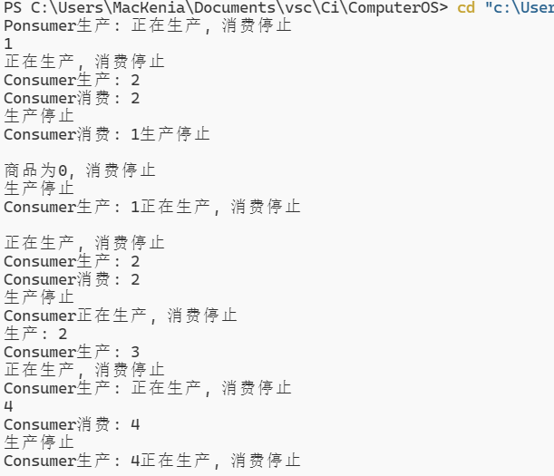

# 实验一 进程同步控制

[toc]

## 消费者生产者问题

### 代码

```c++
#include <bits/stdc++.h>
#include <thread>
#include <mutex>
#include <unistd.h>

using namespace std;

struct Q
{
    string name;
    int num;
    int size;
    Q() : name(), num(0), size(10) {};
};

void Producer(Q *q, mutex *m)
{
    q->name = "Producer";
    while (true)
    {
        if(m->try_lock())
        {
            cout << q->name << "生产: " << ++q->num << endl;
            m->unlock();
        }
        else
        {
            cout << "生产停止" << endl;
        }
        usleep(100*1000);
    }
}

void Consumer(Q *q, mutex *m)
{
    q->name = "Consumer";
    while (true)
    {
        if(m->try_lock())
        {
            if(q->num > 0)
            {
                cout << q->name << "消费: " << q->num-- << endl;
            }
            else
            {
                cout << "商品为0, 消费停止" << endl;
            }
            m->unlock();
        }
        else
        {
            cout << "正在生产, 消费停止" << endl;
        }
        usleep(100*1000);
    }
    
}

int main()
{
    Q q;
    mutex m;
    thread t1(Producer, &q, &m);
    thread t2(Consumer, &q, &m);
    t1.join();
    t2.join();
    return 0;
}
```

### 结果



### 分析

可以通过使用简单同步锁，来解决生产者消费者问题。当生产者生产商品时，需要加锁，生产完成解锁，消费者消费商品时，需要加锁，消费完成解锁。便可实现进程同步。

## 哲学家吃饭问题

### 代码

```c
#include <pthread.h>
#include <stdio.h>
#include <unistd.h>
#include <unistd.h>

pthread_mutex_t chopsticks[5];

int sWait(pthread_mutex_t *left, pthread_mutex_t *right)
{
    if(!pthread_mutex_trylock(left) && !pthread_mutex_trylock(right))
    {
        return 1;
    }
    else
    {
        return 0;
    }
}

void sSignal(pthread_mutex_t *left, pthread_mutex_t *right)
{
    pthread_mutex_unlock(left);
    pthread_mutex_unlock(right);
}

void *Philosopher(void* tid)
{
    int id = *(int*)tid + 1;
    printf("[Philosopher %d] is ready.\n", id);
    while (1)
    {
        if (sWait(&chopsticks[id], &chopsticks[(id + 1) % 5]))
        {
            printf("Philosopher %d is eating\n", id);
            sSignal(&chopsticks[id], &chopsticks[(id + 1) % 5]);
        }
        usleep(rand()%1000*1000);
    }
}

int main()
{
    pthread_t threads[5];
    for(int i = 0; i < 5; i++)
    {
        pthread_create(&threads[i], NULL, Philosopher, (void*)&i);
        usleep(1*1000); // 等待当前线程创建完成再进行下一个线程的创建
    }
    usleep(1000*10*1000);
    return 0;
}

```

### 结果


### 分析

使用and型信号量，当哲学家能够同时拿到左右两只筷子时，就可以吃饭。

## 读者写者问题

### 代码

```c
#include <stdio.h>
#include <pthread.h>
#include <stdlib.h>
#include <unistd.h>

pthread_mutex_t mutex;

struct readers
{
    int count;
    int max;
} r;

int readerctl(struct readers *r, pthread_mutex_t *mutex)
{
    if (!pthread_mutex_lock(mutex))
    {
        if (r->count < r->max)
        {
            r->count++;
            pthread_mutex_unlock(mutex);
            return 1;
        }
    }
    else
    {
        return 0;
    }
}

int readerdec(struct readers *r, pthread_mutex_t *mutex)
{
    if (!pthread_mutex_lock(mutex))
    {
        if (r->count > 0)
        {
            r->count--;
            pthread_mutex_unlock(mutex);
            return 1;
        }
    }
    else
    {
        return 0;
    }
}

int writerctl(struct readers *r, pthread_mutex_t *mutex)
{
    if (!r->count)
    {
        pthread_mutex_trylock(mutex);
        return 1;
    }
    else
        return 0;
}

void *writer()
{
    int c = 1;
    while (c)
    {
        if (writerctl(&r, &mutex))
        {
            printf("Writer is writing chapter %d\n", c++);
            usleep(1000*1000);
            printf("Writer is done writing\n");
            pthread_mutex_unlock(&mutex);
        }
        usleep(200*1000);
    }
}

void *reader(void *args)
{
    int id = *(int *)args + 1;
    while (1)
    {
        if (readerctl(&r, &mutex))
        {
            printf("Reader %d is reading\n", id);
            usleep(1000*1000);
            printf("Reader %d is done reading\n", id);
            readerdec(&r, &mutex);
        }
        usleep(300*1000);
    }
}

int main()
{
    r.max = 2;
    pthread_t twriter;
    pthread_t treader[2];
    pthread_create(&twriter, NULL, writer, NULL);
    for (int i = 0; i < 2; i++)
    {
        pthread_create(&treader[i], NULL, reader, (void *)&i);
        usleep(1*1000);
    }
    usleep(10000*1000);
    return 0;
}
```

### 结果


### 分析

使用信号量集合，当读者数量为0是作者可以写作，写作时将加锁，写完再解锁。读者在阅读时，读者数目增加时获取锁，增加完解锁。阅读完成也是同理，保证了多个读者可以同时阅读。而读写不能同时进行。
