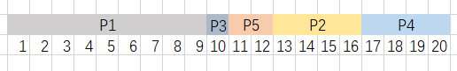
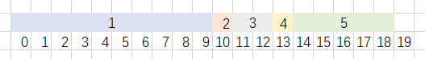
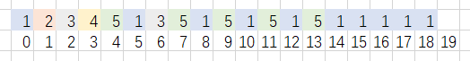

[toc]
# 第三章作业

## 19题

> 题目：有5个进程需要调度执行，若采用非抢占式优先级（短进程优先）调度算法，问这5个进程的平均周转时间是多少？

进程|到达时间|执行时间
---|---|---
P1|0.0|9
P2|0.4|4
P3|1.0|1
P4|5.5|4
P5|7|2

### 解 19

周转时间：

$$
P1:9-0.0=9.0
$$
$$
P2:16-0.4=15.6
$$
$$
P3:10-1.0=9.0
$$
$$
P4:20-5.5=14.5
$$
$$
P5:12-7=5.0
$$

平均周转时间：

$$
T=(P1+P2+P3+P4+P5)/5=(9.0+15.6+9.0+14.5+5)/5=10.62
$$

## 20题

> 题目：假定要在一台处理机上执行作业，且假定这些作业在时刻0以及1，2，3，4，5的顺序到达。请说明分别采用`FCFS`、`RR`（时间片为1）、`SJF`及非抢占式优先级算法时，这些作业的执行情况（优先级的高低顺序依次为1到5）。针对上述每种调度算法给出平均周转时间和平均带权周转时间

作业|执行时间|优先级
---|---|---
1|10|3
2|1|1
3|2|3
4|1|4
5|5|2

### 解20

#### `FCFS`算法

平均周转时间：

$$
T=(10+11+13+14+19)/5=67/5=13.4
$$

带权周转时间： (权值为作业周转时间T与系统为之服务时间TS之比)

$$
W1=10/10=1
$$

$$
W2=11/1=11
$$

$$
W3=13/2=6.5
$$

$$
W4=14/1=14
$$

$$
W5=19/5=3.8
$$

平均带权周转时间：

$$
W=(W1+W2+W3+W4+W5)/5=(1+11+6.5+14+3.8)/5=36.3/5=7.26
$$

#### RR算法

平均周转时间：

$$
T=(T1+T2+T3+T4+T5)/5=(19+1+4+2+9)/5=7
$$

平均带权周转时间
：
$$
W=(W1+W2+W3+W4+W5)/5=(1.9+1+2+2+1.8)/5=1.74
$$

#### SJF算法

平均周转时间：

$$
T=(T1+T2+T3+T4+T5)/5=(16+1+18+19+6)/5-12
$$

平均带权周转时间：
$$
W=(W1+W2+W3+W4+W5)/5=(1.6+1+9+19+1.2)/5=6.36
$$

## 22题

> 题目：由5个进程组成进程集合$P=\{P_0,P_1,P_2,P_3,P_4\}$，且系统中有三类资源`A`,`B`,`C`，假设在某时刻有如下进程分配情况，问当`x`,`y`,`z`取`1,4,0`、`0,6,2`、`1,1,1`、`0,4,7`时系统是否处于安全状态？

进程|Allocation|Max|Available
:-:|:-:|:-:|:-:
P0|`0 0 3`|`0 0 4`|`x y z`
P1|`1 0 0`|`1 7 5`|`x y z`
P2|`1 3 5`|`2 3 5`|`x y z`
P3|`0 0 2`|`0 6 4`|`x y z`
P4|`0 0 1`|`0 6 5`|`x y z`

### 解 22

#### `1, 4, 0` 时 安全

其中一个安全序列为：

进程|Work|Need|Allocation|Work+Allocation|Finish
:-:|:-:|:-:|:-:|:-:|:-:
P2|`1 4 0`|`1 0 0`|`1 3 5`|`2 7 5`|True
P0|`2 4 5`|`0 0 1`|`1 0 0`|`3 7 5`|True
P1|`3 7 5`|`0 7 5`|`1 0 0`|`4 7 5`|True
P3|`4 7 5`|`0 6 2`|`0 0 2`|`4 7 7`|True
P4|`4 7 7`|`0 6 4`|`0 0 1`|`4 7 8`|True

#### `0, 6, 2` 时 不安全

#### `1, 1, 1` 时 不安全

#### `0, 4, 7` 时 不安全
