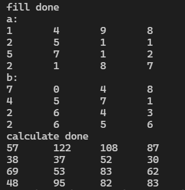

[toc]

## 1. 作业任务描述

    求两个n阶矩阵的乘积

## 2. 作业设计思路

    创建a, b, c三个多维数组作为矩阵，a, b矩阵作为输入，c矩阵作为输出，通过双重循环，对a, b两个不同的矩阵进行列的遍历，放入c矩阵当中。

## 3. 代码实现

```c++
#include <bits/stdc++.h>

int main()
{
    int a[N][N], b[N][N], c[N][N];
    int n = N;
    for(int i = 0; i < n; i++)
    	for(int j = 0; j < n; j++)
	{
		a[i][j] = rand() % 100;
		b[i][j] = rand() % 100;
	}
    cout << "fill done" << endl;
    cout << "a:" << endl;
    for(int i = 0; i < n; i++)
    {
	    for(int j = 0; j < n; j++)
	    {
		    cout << c[i][j] << "\t";
	    }
	    cout << endl;
    }
    cout << "b:" << endl;
    for(int i = 0; i < n; i++)
    {
	    for(int j = 0; j < n; j++)
	    {
		    cout << c[i][j] << "\t";
	    }
	    cout << endl;
    }
    for(int i = 0; i < n; i++)
        for(int j = 0; j < n; j++)
        
            for(int k = 0; k < n; k++)
                c[i][j] = c[i][k] + a[i][k] * b[k][j];
        }
    cout << "calculate done" << endl;
    for(int i = 0; i < n; i++)
    {
	    for(int j = 0; j < n; j++)
	    {
		    cout << c[i][j] << "\t";
	    }
	    cout << endl;
    }
    
    return 1;
}

```

## 4. 输入的数据及得到的结果

输入数据为系统随机生成的数据



## 5. 评估算法的复杂度


