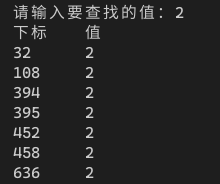

[toc]

## 1. 作业任务描述

在一维数组a中顺序查找某个值等于e的元素，并返回其所在的位置

## 2. 作业设计思路

使用循环遍历数组中的所有元素，对每个元素一一进行匹配，输出匹配的下标，直到循环结束

## 3. 代码实现

``` c++
#include <bits/stdc++.h>

using namespace std;

int main()
{
    int a[1000];
    cout << "请输入要查找的值：";
    int e;
    cin >> e;
    for(int i = 0; i < 1000; i++)
    {
        a[i] = rand() % 100;
    }
    for(int i = 0; i < 1000; i++)
    {
        if(a[i] == e) cout << i + 1 << " " << a[i] << endl;
    }
    return 1;
}
```

## 4. 输入的数据及得到的结果

用户输入需要查找的值，程序在自动生成的数组值中查找对于的值，并输出



## 5. 评估算法的复杂度

由于要筛选出所有所有匹配的项，所以不存在最大最小时间

基本语句为：`if(a[i] == e) cout << i + 1 << " " << a[i] << endl;`

时间复杂度为：$T(n) = O(n)$

空间复杂度为：$S(n) = O(1)$
