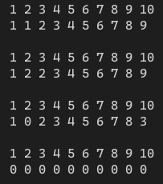

[toc]

## 1. 作业任务描述

两端都可以入队和出队的循环队列
写出循环队列的类型定义
写出“从队尾删除” 和 “从队头插入”的算法

## 2. 作业设计思路

定义一个结构体，将对应的操作封装到其中方便直接调用，当队头指针向前移动时，则减一加队列长度再和长度进行摸运算，指针便指向队尾，队尾指针依然

## 3. 代码实现

```c++
#include <bits/stdc++.h>
#define N 10

using namespace std;

struct iQueue
{
    int *v;
    int front;
    int rear;
    int operator++() //队头指针向后移动
    {
        int tmp = front;
        front=(front+1+N)%N;
        return tmp;
    }

    int operator--() //队头指针向前移动
    {
        return front=(front-1+N)%N;
    }

    int operator++(int) //队尾指针向后移动
    {
        int tmp = rear;
        rear=(rear+1+N)%N;
        return tmp;
    }

    int operator--(int) //对尾指针向前移动
    {
        return rear=(rear-1+N)%N;
    }

    void push(int a) //队尾入队
    {
        v[(*this)++] = a;
    }

    void pop() //队尾出队
    {
        v[(*this)--] = 0;
    }

    void shift(int a) //队头入队
    {
        v[--(*this)] = a;
    }

    void unshift() //队头出队
    {
        v[++(*this)] = 0;
    }
};

void show(iQueue sq) // 显示队中的所有元素
{
    for(int i = 0; i < N; i++) cout << i+1 << " ";
    cout << endl;
    for(int i = 0; i < N; i++)
    {
        cout << sq.v[i] << " ";
    }
    cout << endl << endl;
}

int main()
{
    iQueue sq;
    sq.v = new int[N];
    sq.front = 0;
    sq.rear = 0;
    for(int i = 0; i < N; i++)
    {
        sq.push(i);
    }
    sq.push(1);
    show(sq);
    sq.push(2);
    show(sq);
    sq.pop();
    sq.shift(3);
    show(sq); // 显示队中的元素
    for(int i = 0; i < N; i++) //全部从队头弹出测试首尾是否相连
    {
        sq.unshift();
    }
    show(sq);
    return 1;
}
```

## 4. 输入的数据及得到的结果

无输入数据

输出结果：


## 5. 评估算法的复杂度

该算法的复杂度与用户的操作有关

时间复杂度为：$T(n) = O(n)$

空间复杂度为：$S(n) = O(1)$
