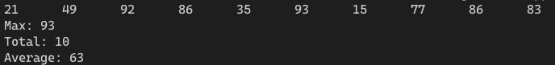

[toc]

## 1. 作业任务描述

已知f为但链表的表头指正，链表中储存的都是整形数据，试写出实现下列运算的递归算法
- 求链表中的最大整数
- 求链表的节点数
- 求所有整数的平均值

## 2. 作业设计思路

设置当结点的next指向为空时为结束条件，否则调用自身传入下一个节点，不断重复直到结束，即可达到想要的效果，平均值则需要先求总和再除以总数

## 3. 代码实现

```c++
#include <bits/stdc++.h>
#include "List.h"
#define N 10

using namespace std;

struct List {
    int data;
    List *next;
};

int getMax(List *list) //获取最大值
{
    if(list->next == NULL) return list->data;
    else return (list->data > getMax(list->next) ? list->data : getMax(list->next));
}

int getTot(List *list) //获取总节点数
{
    if(list->next == NULL) return 0;
    else return (1+getTot(list->next));
}

int getSum(List *list) //获取所用数加起来的总和
{
    if(list->next == NULL) return list->data;
    else return (list->data + getSum(list->next));
}

int getAve(List *list) //获取平均值
{
    return getSum(list)/getTot(list);
}

int main()
{
    LTT<List> tool; //创建自己的写的链表操纵工具
    List *head = new List();
    List *p = NULL;
    head->next = NULL;
    for (int i = 0; i < N; i++)
    {
        p = new List();
        p->data = rand() % 100; // 系统随机赋值
        p->next = NULL;
        p = tool.addA(head, p); // 使用工具连接链表
    }
    p = head->next;
    for(int i = 0; i < N; i++, p = p->next)
    {
        cout << p->data << "\t"; // 输出链表
    }
    cout << endl;
    cout << "Max: " << getMax(head) << endl;
    cout << "Total: " << getTot(head) << endl;
    cout << "Average: " << getAve(head) << endl;
    return 0;
}
```

## 4. 输入的数据及得到的结果

无输入数据，所有数据均为系统随机生成

输出：


## 5. 评估算法的复杂度

算法复杂度与数据的规模成正比

时间复杂度为：$T(n) = O(n)$

没有申请新的空间所以
空间复杂度为：$S(n) = O(1)$

