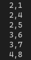

[toc]

## 1. 作业任务描述

系数多项式的计算

## 2. 作业设计思路

对多项式的每一项进行遍历，指数相同的便相加

## 3. 代码实现

```c++
#include <bits/stdc++.h>
#define N 5

using namespace std;

struct Polynomial
{
    int coefficient;
    int exponential;
};

int main()
{
    Polynomial a[2 * N];
    Polynomial b[N] = {{2, 1}, {1, 4}, {3, 7}, {4, 8}};
    Polynomial c[N] = {{1, 4}, {2, 5}, {3, 6}};
    int i = 0, j = 0, k = 0;
    while (b[i].exponential != 0 || c[j].exponential != 0)
    {
        if (b[i].exponential == c[j].exponential)
        {
            a[k].exponential = b[i].exponential;
            a[k++].coefficient = b[i++].coefficient + c[j++].coefficient;
        }
        else if (b[i].exponential < c[j].exponential)
        {
            if(b[i].exponential == 0)
            {
                a[k].exponential = c[j].exponential;
                a[k++].coefficient = c[j++].coefficient;
            }
            else
            {
                a[k].exponential = b[i].exponential;
                a[k++].coefficient = b[i++].coefficient;    
            }
        }
        else
        {
            if(c[j].exponential == 0)
            {
                a[k].exponential = b[i].exponential;
                a[k++].coefficient = b[i++].coefficient;
            }
            else
            {
                a[k].exponential = c[j].exponential;
                a[k++].coefficient = c[j++].coefficient;
            }
        }
    }
    for(int i = 0; i < k; i++)
    {
        cout << a[i].coefficient << "," << a[i].exponential << endl;
    }
    return 0;
}
```

## 4. 输入的数据及得到的结果

输入数据：
第一组：{{2, 1}, {1, 4}, {3, 7}, {4, 8}}
第二组：{{1, 4}, {2, 5}, {3, 6}}

输出数据：


## 5. 评估算法的复杂度

基本语句为`while`循环中的`if`语句

时间复杂度为：$T(n) = O(n)$

空间复杂度为：$S(n) = O(n)$