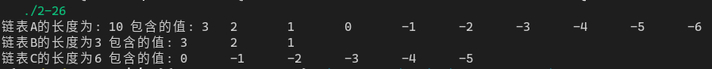

[toc]

## 1. 作业任务描述

链表的分解

## 2. 作业设计思路

遍历链表中的每个元素，使用`if`判断条件即可。

## 3. 代码实现

```c++
#include <bits/stdc++.h>
#include "List.h" // 自建链表操作库

using namespace std;

struct Node
{
    int data;
    Node* next;
};

int main()
{
    LTT<Node> tool;
    Node* a, *b, *c, *p;
    a = new Node;
    a->data = 10;
    a->next = nullptr;
    b = new Node;
    c = new Node;
    b->data = 0;
    c->data = 0;
    for (int i = 0; i < 10; i++)
    {
        p = new Node;
        p->data = i-6;
        p->next = nullptr;
        tool.addA(a,p);
    }
    cout << "链表A的长度为: "<< a->data <<" 包含的值: ";
    tool.print(a->next);
    for (Node *m = b, *n = c, *p=a->next, *q = p->next; q;p = q, q = q->next)
    {
        if(p->data > 0)
        {
            tool.addA(m, p);
            m = m->next;
            b->data++;
        }
        else
        {
            tool.addA(n, p);
            n = n->next;
            c->data++;
        }
    }
    cout << "链表B的长度为"<<b->data<<" 包含的值: ";
    tool.print(b->next);
    cout << "链表C的长度为"<<c->data<<" 包含的值: ";
    tool.print(c->next);
    return 0;
}
```

## 4. 输入的数据及得到的结果

程序自动生成`-3～6`进行判断

结果: 


## 5. 评估算法的复杂度

由于是单次遍历时间复杂度为: $O(t) = O(n)$

无额外辅助空间空间复杂度为: $S(n) = O(1)$
