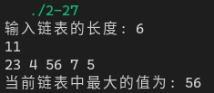

[toc]

## 1. 作业任务描述

查找单链表的最大元素

## 2. 作业设计思路

遍历链表并逐个比对，遍历结束即可找到所需值

## 3. 代码实现

```c++
#include <bits/stdc++.h>
#include "List.h"
using namespace std;

struct Node
{
    int data;
    Node *next;
};

int Biggest(Node *p)
{
    int big = p->data;
    while (p)
    {
        if(p->data > big) big = p->data;
        p = p->next;
    }
    return big;
}

int main()
{
    int a, n;
    Node *list, *p;
    LTT<Node> tool;
    list = new Node;
    list->next = nullptr;
    p = list;
    cout << "输入链表的长度: ";
    cin >> n;
    list->data = n;
    while (n--)
    {
        cin >> a;
        Node *q = new Node;
        q->data = a;
        q->next = nullptr;
        tool.addA(p,q);
        p = p->next;
    }
    cout <<"当前链表中最大的值为: "<< Biggest(list) << endl;
    return 0;
}
```

## 4. 输入的数据及得到的结果

输入内容: 
`11 23 4 56 7 5`

结果: 


## 5. 评估算法的复杂度

遍历单链表 时间复杂度为: $T(n) = O(n)$

空间复杂度为: $S(n) = O(1)$

