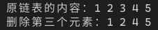

[toc]

## 1. 作业任务描述

顺序表的删除操作

## 2. 作业设计思路

将链表的操作总结到相应的模板类中，调用该头文件即可

## 3. 代码实现

List.h:
```c++
#include <bits/stdc++.h>

#ifndef LIST_H
#define LIST_H

using namespace std;

template<typename T>
class LTT
{
public:
    T *addA(T *p, T *q);
    T *addB(int n,T *p, T *q);
    T *delA(T *p, T *q);
    T *delB(int n, T *q);
    void del(T *p);
    T *searchA(int tar, T *p);
};

template<typename T>
T *LTT<T>::addA(T *p, T *q)
{
    q->next = p->next;
    p->next = q;
    return p->next;
}

template<typename T>
T *LTT<T>::addB(int n,T *p, T *q)
{
    for (int i = 0; i < n - 1; i++)
        p = p->next;
    q->next = p->next;
    p->next = q;
    return p->next;
}

template<typename T>
T *LTT<T>::delA(T *p, T *q)
{
    p->next = q->next;
    delete q;
    return p;
}

template<typename T>
T *LTT<T>::delB(int n, T *q)
{
    T *p = NULL;
    for(int i = 0; i < n - 1; i++)
        q = q->next;
    p = q;
    q = q->next;
    p->next = q->next;
    delete q;
    return p;
}

template<typename T>
T *LTT<T>::searchA(int n, T *q)
{
    for (int i = 0; i < n; i++)
        q = q->next;
    return q;
}

template<typename T>
void LTT<T>::del(T *p)
{
    T *q = p->next;
    p = q->next->next;
    for(; p->next != NULL; p = p->next, q = p)
    {
        delete q;
    }
    delete q;
}
#endif
```

实现cpp文件：
```c++
#include <iostream>
#include "List.h"

using namespace std;

struct ls
{
    int first;
    ls *next;
};

int main()
{
    LTT<ls> tool;
    ls *list, *p, *q;
    ls head;
    // 创建结点并赋值
    list = &head;
    list->first = 0;
    list->next = NULL;
    q = list;
    for(int i = 0; i < 5; i++)
    {
        p = new ls;
        p->next = NULL;
        p->first = i+1;
        // 链接到头节点
        p = tool.addA(q, p);
        list->first++;
        q = p;
    }

    // 输出内容链表内容
    cout << "原链表的内容：";
    p = list->next;
    int t = list->first;
    while(t--)
    {
        cout << p->first << " ";
        p = p->next;
    }
    cout << endl;

    tool.delB(3, list);

    // 输出内容链表内容
    cout << "删除第三个元素：";
    p = list->next;
    while(--list->first)
    {
        cout << p->first << " ";
        p = p->next;
    }
    cout << endl;
    tool.del(list);
    return 0;
}
```
## 4. 输入的数据及得到的结果
输入内容：1 2 3 4 5
输出内容：


## 5. 评估算法的复杂度

基本语句为`cout << p->first << " "`

时间复杂度为：$T(n) = O(n)$

空间复杂的为：$S(n) = O(1)$
