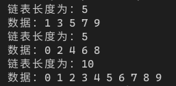

[toc]

## 1. 作业任务描述

合并有序链表

## 2. 作业设计思路

对两条链进行遍历，将所存数值较小的放到较大数之前

## 3. 代码实现

```c++
#include <bits/stdc++.h>
#include "List.h"
#define N 10

using namespace std;

struct L
{
    int first;
    L *next;
};

LTT<L> tool;

L *newL()
{
    L *n = new L;
    n->first = 0;
    n->next = NULL;
    return n;
}

L *newL(int m)
{
    L *n = new L;
    n->first = m;
    n->next = NULL;
    return n;
}

void show(L *p)
{
    L *q = p->next;
    cout << "链表长度为：" <<p->first << endl << "数据：";
    for (int i = 0; i < p->first; i++)
    {
        cout << q->first << " ";
        q = q->next;
    }
    cout << endl;
}

int main()
{
    L *F, *S, *p, *q;
    int i = 1, j = 1;
    F = newL(N/2);
    S = newL(N/2);
    p = F, q = S;
    for(int i = 0; i < N; i++)
    {
        if(i%2)
        {
            p = tool.addA(p, newL(i));
        }
        else
        {
            q = tool.addA(q, newL(i));
        }
    }
    show(F);
    show(S);
    p = F->next, q = S->next;
    while(i <= N/2 || j <= N/2)
    {
        if(p->first == q->first)
        {
            i++, j++;
            p = p->next;
            q = q->next;
        }
        else if(p->first < q->first)
        {
            i++;
            p = p->next;
        }
        else
        {
            L *t = q;
            q = q->next;
            tool.addA(tool.searchA(i-1, F), t);
            F->first++;
            i++, j++;
        }
    }
    show(F);
    return 0;
}
```
## 4. 输入的数据及得到的结果

无输入数据

输入数据为：


## 5. 评估算法的复杂度

基本语句为：`while`循环中的`if else`

时间复杂度为：$T(n) = O(n)$

空间复杂度为：$S(n) = O(1)$
