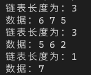

[toc]

## 1. 作业任务描述

用链表实现集合的差

## 2. 作业设计思路
使用双循环，遍历两个链表，发现相同的便跳过，为发现则放入新的链中，最后输出
## 3. 代码实现
```c++
#include <bits/stdc++.h>
#include "List.h"

using namespace std;

struct ge
{
    int first;
    ge *next;
};

LTT<ge> tool;

ge *newGe()
{
    ge *n = new ge;
    n->first = 0;
    n->next = NULL;
    return n;
}

ge *newGe(int m)
{
    ge *n = new ge;
    n->first = m;
    n->next = NULL;
    return n;
}

void show(ge *p)
{
    ge *q = p->next;
    cout << "链表长度为：" <<p->first << endl << "数据：";
    for (int i = 0; i < p->first; i++)
    {
        cout << q->first << " ";
        q = q->next;
    }
    cout << endl;
}

void genrand(ge *p)
{
    ge *q, *t = p;
    int n = 0;
    while(!n)
    {
        n = (int)(rand() % 10);
    }
    p->first = n;
    for(int i = 0; i < n; i++)
    {
        q = newGe((int)(rand()%10));
        p = tool.addA(p, q);
    }
    show(t);
}

ge *min(ge *p, ge *q)
{
    ge *n = newGe();
    ge *nn = n, *pp = p, *qq = q;
    int i, j;
    for(i = 0, p = pp->next; i < pp->first; i++)
    {
        for (j = 0, q = qq->next; j < qq->first; j++)
        {
            if(p->first == q->first) break;
            q = q->next;
        }
        if(j >= qq->first)
        {
            nn = tool.addA(nn, newGe(p->first));
            n->first++;
        }
        p = p->next;
    }
    return n;
}

int main()
{
    ge *F, *S, *T;
    F = newGe();
    S = newGe();
    T = newGe();
    genrand(F);
    genrand(S);
    T = min(F, S);
    show(T);
    return 0;
}
```
## 4. 输入的数据及得到的结果
输入数据为程序随机生成

输出结果：

## 5. 评估算法的复杂度

基本语句为：`for`双循环

时间复杂度为：$T(n) = O(n^2)$

空间复杂度为：$S(n) = O(n)$
