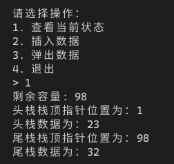

[toc]

## 1. 作业任务描述

双向栈
编写初始化、判断栈空、栈满、进栈和出栈等的算法函数
## 2. 作业设计思路

题目给出的思路相当清晰，创建一个数组作为栈，当栈顶指针减去栈底指针等于数组长度时栈满，为零则栈空

## 3. 代码实现
```c++
#include <bits/stdc++.h>
#define Max 100

using namespace std;

typedef struct
{
    int top[2], bot[2];
    int *v;
    int m;
} DblStack;

void insert(DblStack &d)
{
    int choice;
    int tmp;
    if(d.top[1] - d.top[0] == 1)
    {
        cout << "堆栈已满";
        return;
    }
    cout << "请输入数据：";
    cin >> tmp;
    cin.ignore();
    cout << "1. 在头栈插入" << endl
         << "2. 在尾栈插入" << endl
         << "> ";
    cin >> choice;
    switch (choice)
    {
    case 1:
        d.v[d.top[0]++] = tmp;
        break;
    case 2:
        d.v[d.top[1]++] = tmp;
        break;
    }
    cout << "成功" << endl << endl;
}

void pop(DblStack d)
{
    int choice;
    cout << "1. 在头栈弹出" << endl
         << "2. 在尾栈弹出" << endl
         << "> ";
    cin >> choice;
    switch (choice)
    {
    case 1:
        d.v[d.top[0]--] = 0;
        break;
    case 2:
        d.v[d.top[1]--] = 0;
        break;
    }
    cout << "成功" << endl << endl;
}

char gethead(DblStack d)
{
    for(int i = d.bot[0]; i < d.top[0]; i++)
    {
        cout << d.v[i] << " ";
    }
    return 0;
}

char gettail(DblStack d)
{
    for (int i = d.bot[1]; i > d.top[1]; i--)
    {
        cout << d.v[i];
    }
    return 0;
}

void info(DblStack d)
{
    cout << "剩余容量: " << d.top[1] - d.top[0] + 1 << endl
    << "头栈栈顶指针位置为：" << d.top[0] << endl
    << "头栈数据为：" << gethead(d) << endl
    << "尾栈栈顶指针位置为：" << d.top[1] << endl
    << "尾栈数据为：" << gettail(d) << endl << endl;
}

int main()
{
    // initial DoubleStack
    DblStack DStack;
    int stack[Max];
    DStack.v = stack;
    DStack.top[0] = 0;
    DStack.bot[0] = 0;
    DStack.bot[1] = Max - 1;
    DStack.top[1] = Max - 1;
    DStack.m = Max;

    // Operations
    bool flag = true;
    int choice;
    cout << "当前栈可容纳的最大元素个数为：" << Max << endl;
    while (flag)
    {
        cout << "请选择操作：" << endl
             << "1. 查看当前状态" << endl
             << "2. 插入数据" << endl
             << "3. 弹出数据" << endl
             << "4. 退出" << endl
             << "> ";
        cin >> choice;
        cin.ignore();
        switch (choice)
        {
        case 1:
            info(DStack);
            break;
        case 2:
            insert(DStack);
            break;
        case 3:
            pop(DStack);
            break;
        case 4:
            flag = false;
            break;
        }
    }

    return 1;
}
```
## 4. 输入的数据及得到的结果

输入数据：23 32
结果：


## 5. 评估算法的复杂度

本算法与用户的操作次数有关

时间复杂度：$T(n) = O(n)$

空间复杂度：$S(n) = O(n)$
