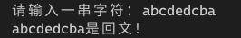
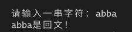
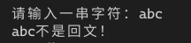

[toc]

## 1. 作业任务描述

回文是指正读反读均相同的字符序列，如“abba”和“abdba”均是回文，但“good”不是回文。试写一个算法判定给定的字符序列是否为回文。（提示：将一半的字符入栈）

## 2. 作业设计思路

按照题目要求创建一个链栈，使用一个循环探测字符串长度，并将一半的字符入栈，若为奇数则跳过中间的字符，之后逐一弹出与之后的字符进行比对，若相同则为回文，不同则不为回文。

## 3. 代码实现
```c++
#include <bits/stdc++.h>
#include "List.h"

using namespace std;

struct LStrack
{
    int data;
    LStrack *next;
}tmp;

int main()
{
    LStrack *ls = NULL, *t = NULL;
    LTT<LStrack> tool;
    char st[80];
    int len = 0, i = 0;
    cout << "请输入一串字符：";
    cin >> st;
    for(int i = 0; st[i] != '\0'; i++) len++;
    tmp.data = st[0];
    tmp.next = NULL;
    ls = &tmp;
    for(i = 1; i < len/2; i++)
    {
        t = new LStrack;
        t->data = st[i];
        t->next = NULL;
        ls = tool.push(t, ls);
    }
    if(len%2) i = len/2 + 1;
    for( ; i < len; i++)
    {
        if(ls->data != st[i]) break;
        if(i != len-1) ls = tool.pop(ls);
    }
    if(i < len)
    {
        cout << st << "不是回文！" << ls->data << endl;
        tool.del(ls);
    }
    else
        cout << st << "是回文！" << endl;
    return 1;
}
```
## 4. 输入的数据及得到的结果

输入数据：abcdedcba abba abc

结果：




## 5. 评估算法的复杂度

算法复杂度与用户输入的字符串长度有关

时间复杂度：$T(n) = O(n)$

空间复杂度为：$S(n) = O(n)$
