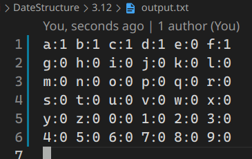

[toc]

## 1. 作业任务描述

字符频度统计

## 2. 作业设计思路

首先遍历输入的字符，通过对字符的ASCII码进行计算，将结果对应的数组下标中的值进行`+1`操作，最后输出统计数组即可.

## 3. 代码实现

```c++
#include <bits/stdc++.h>

using namespace std;

int main()
{
    fstream file("output.txt", ios::out);
    char t;
    int sum[36];
    memset(sum, 0, sizeof(sum));
    if (file.fail())
    {
        cout << "open file fail";
        exit(0);
    }
    cout << "input a string end with '#': ";
    while (scanf("%c", &t) && t != '#')
    {
        if (t >= 'a' && t <= 'z')
        {
            sum[t - 'a']++;
        }
        else if (t >= '0' && t <= '9')
        {
            sum[t - '0' + 26]++;
        }
    }
    for (int i = 0; i < 36; i++)
    {
        if (i < 26)
            file << (char)('a' + i) << ':' << sum[i] << "\t";
        else
            file << (char)('0' + i - 26) << ':' << sum[i] << "\t";
        if(!((i + 1) % 6)) file << '\n';
    }
    file.close();
    return 1;
}
```

## 4. 输入的数据及得到的结果

输入：`abcdf#`

输出结果:


## 5. 评估算法的复杂度

算法时间复杂度取决于用户输入的字符数量假定字符数量为：n

时间复杂度为：$O(T) = O(n)$

算法空间复杂度为：$O(S) = O (1)$
