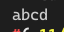

[toc]

## 1. 作业任务描述

子串插入

## 2. 作业设计思路

首先将字符的长度统计出来，将要主串腾出足够的空间，在将子串插入对应的区域

## 3. 代码实现

```c++
#include <bits/stdc++.h>

using namespace std;

void insert(char* s, char* t, int pos)
{
    int i, j;
    for (i = 0; s[i] != '\0'; i++); //get length of each string
    for (j = 0; t[j] != '\0'; j++);
    for ( ; i >= pos; i--) // move char to get enough space
    {
        s[j + i - 1] = s[i - 1];
    }
    for(i = 0; i < j; i++) // insert t into s
    {
        s[i + pos - 1] = t[i];
    }
}

int main()
{
    char a[6] = "ad";
    char b[3] = "bc";
    insert(a, b, 2);
    cout << a << endl;
    return 0;
}
```

## 4. 输入的数据及得到的结果

无输入内容。

输出内容：


## 5. 评估算法的复杂度

时间复杂度取决于字符串的长度

时间复杂度为：$O(T) = O(n)$

空间复杂度为：$O(S) = O(n)$
