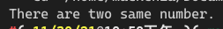

[toc]

## 1. 作业任务描述

元素完全相异数组判断

## 2. 作业设计思路

通过双重循环遍历数组中的每个元素进行对比，若相同直接退出程序并输出结果即可

## 3. 代码实现

```c++
#include <bits/stdc++.h>
#define M 10
#define N 10

using namespace std;

int main()
{
    int A[M][N];
    memset(A, 0, sizeof(A));
    for(int i = 0; i < M; i++)
        for(int j = 0; j < N; j++)
        {
            A[i][j] = rand() % 20;
        }
    for(int i = 0; i < M*N; i++)
        for(int j = i; j < M*N; j++)
        {
            if(*(A+i) == *(A+j))
            {
                cout << "There are two same number." << endl;
                return 1;
            }
        }
    cout << "Yes" << endl;
    return 1;
}
```

## 4. 输入的数据及得到的结果

无输入数据

输出：


## 5. 评估算法的复杂度

$O(T) = O(M*N)$

$O(S) = O(M*N)$

