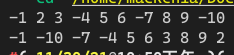

[toc]

## 1. 作业任务描述

数组元素正负排列

## 2. 作业设计思路

使用两个指针分别指向头部和尾部，移动头部指针时判断是否为负数，若是则与尾指针交换，为指针向前移动，知道两个指针重合

## 3. 代码实现

```c++
#include <bits/stdc++.h>
#define N 10

using namespace std;

int main()
{
    int A[N];
    memset(A, 0, sizeof(A));
    for (int i = 0; i < N; i++)
    {
        if(i%3) A[i] = i+1;
        else A[i] = -(i+1);
    }
    for(int i = 0; i < N; i++)
    {
        cout << A[i] << " ";
    }
    cout << endl;
    for (int i = 0, j = N-1; i < j;)
    {
        int tmp;
        if(A[i] < 0 && A[j] > 0)
        {
            i++, j--;
        }
        else if(A[i] < 0 && A[j] < 0)
        {
            i++;
        }
        else if(A[i] > 0 && A[j] > 0)
        {
            j--;
        }
        else
        {
            tmp = A[i];
            A[i] = A[j];
            A[j] = tmp;
            continue;
        }
    }
    for(int i = 0; i < N; i++)
    {
        cout << A[i] << " ";
    }
    cout << endl;
    return 0;
}
```

## 4. 输入的数据及得到的结果

无输入数据

输出：


## 5. 评估算法的复杂度

时间复杂度为： $O(T) = O(n)$

空间复杂度为：$O(S) = O(1)$

