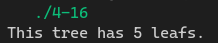

[toc]

## 1. 作业任务描述

统计二叉树的叶节点

## 2. 作业设计思路

利用递归调用当节点为叶节点时返回1, 否则返回0. 

## 3. 代码实现

```c++
#include <bits/stdc++.h>
#define N 10

using namespace std;

struct tree 
{
    int data;
    tree *left;
    tree *right;
};

int count(tree *h)
{
    if(h == nullptr) return 0;
    if(h->left==nullptr && h->right == nullptr)
        return 1;
    else
        return count(h->left) + count(h->right);
}

void init(tree *(*node), int *arr, int n, int i = 1)
{
    *node = new tree;
    (*node)->data = arr[i-1];

    if(!(2*i > n))
        init(&(*node)->left, arr, n, 2*i);
    if(!(2*i+1 > n))
        init(&(*node)->right, arr, n, 2*i+1);
}

int main()
{
    tree *head;
    int arr[N];
    for(int i = 0; i < N; i++)
        arr[i] = rand() % N;

    init(&head, arr, N);
    cout << "This tree has " << count(head) << " leafs." << endl;
    return 0;
}
```
## 4. 输入的数据及得到的结果

程序自动生成`1-10`的完全二叉树

运行结果


## 5. 评估算法的复杂度

该算法遍历树的每一个节点时间复杂度为: $T(n) = O(n)$

空间复杂度为: $S(n) = O(1)$