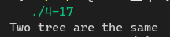
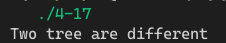

[toc]

## 1. 作业任务描述

判断相等树

## 2. 作业设计思路

同时使用递归遍历两颗子树，并进行比较当比较结果不同时返回0

## 3. 代码实现

```c++
#include <bits/stdc++.h>
#define N 10

using namespace std;

struct tree
{
    int data;
    tree *left;
    tree *right;
};

void init(tree *(*node), int *arr, int n, int i = 1)
{
    *node = new tree;
    (*node)->data = arr[i-1];

    if(!(2*i > n))
        init(&(*node)->left, arr, n, 2*i);
    if(!(2*i+1 > n))
        init(&(*node)->right, arr, n, 2*i+1);
}

int compare(tree *a, tree *b)
{
    if(a==NULL && b!=NULL) return 0;
    if(a!=NULL && b==NULL) return 0;
    if(a->data != b->data) return 0;
    if(a == b) return 1;
    if(compare(a->left, b->left) && compare(a->right, b->right)) return 1;
    else return 0;
}

int main()
{
    tree *a, *b;
    int ar[N], br[N];
    for(int i = 0; i < N; i++)
    {
        ar[i] = rand() % 10;
        br[i] = rand() % 10;
    }
    init(&a, ar, N);
    init(&b, br, N);
    if(compare(a, b))
    {
        cout << "Two tree are the same" << endl;
    }
    else
    {
        cout << "Two tree are different" << endl;
    }
    return 0;
}
```

## 4. 输入的数据及得到的结果

程序自动生成随机的两颗树

当对比 `a` 和 `a` 时结果


当对比 `a` 和 `b` 时结果


## 5. 评估算法的复杂度

对比时遍历两颗树，时间复杂度为：$T(n) = O(n)$

空间复杂度为：$S(n) = O(1)$
