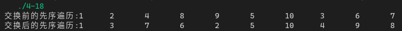

[toc]

## 1. 作业任务描述

交换树的左右儿子

## 2. 作业设计思路

遍历每一个节点交换左右指针

## 3. 代码实现

```c++
#include <bits/stdc++.h>
#define N 10

using namespace std;

struct tree
{
    int data;
    tree *left;
    tree *right;
};

void print(tree *h) //root first
{
    if(h == NULL)
        return;
    else
    {
        printf("%d\t",h->data);
        print(h->left);
        print(h->right);
    }
}

void exchange(tree *(*a), tree *(*b)=NULL)
{
    if(*a == NULL && *b == NULL) return;
    if(*a) exchange(&((*a)->left), &((*a)->right));
    tree *c;
    c = (*a)->left;
    (*a)->left = (*a)->right;
    (*a)->right = c;
    if(b && *b) exchange(&((*b)->left), &((*b)->right));
    else return;
    c = (*b)->left;
    (*b)->left = (*b)->right;
    (*b)->right = c;
}

void init(tree *(*node), int *arr, int n, int i = 1)
{
    *node = new tree;
    (*node)->data = arr[i-1];

    if(!(2*i > n))
        init(&(*node)->left, arr, n, 2*i);
    if(!(2*i+1 > n))
        init(&(*node)->right, arr, n, 2*i+1);
}

int main()
{
    int a[N];
    tree *head;
    for(int i = 0; i < N; i++)
    {
        a[i] = i + 1;
    }
    init(&head, a, N);
    cout << "交换前的先序遍历:";
    print(head);
    exchange(&head);
    cout << endl;
    cout << "交换后的先序遍历:";
    print(head);
    cout << endl;
    return 0;
}
```

## 4. 输入的数据及得到的结果

程序自动生成一颗完全二叉树

结果


## 5. 评估算法的复杂度

交换时历树，时间复杂度为：$T(n) = O(n)$

空间复杂度为：$S(n) = O(1)$
