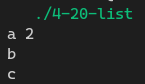
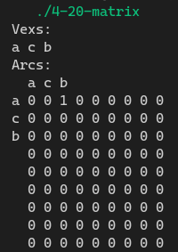

[toc]

## 1. 作业任务描述

利用邻接矩阵和领接表实现图的基本操作

## 2. 作业设计思路

按照树上的概念构建

## 3. 代码实现

邻接矩阵
```c++
#include <bits/stdc++.h>
#define N 9

using namespace std;

struct AMGraph
{
    char vex[N];
    int arcs[N][N];
    int vexNum = 0, arcNum = 0;
};

int InsertVex(AMGraph *g, char v)
{
    g->vex[g->vexNum++] = v;
    return 1;
}

int DeleteVex(AMGraph *g, char v)
{
    int i;
    for (i = 0; i < g->vexNum; i++)
    {
        if(g->vex[i] == v) g->vex[i] = 0;
    }
    strcpy(&g->vex[i],&g->vex[i+1]);
    g->vex[g->vexNum--] = 0;
    for(int j = 0; j < g->vexNum; j++)
    {
        g->arcs[i][j] = 0;
        g->arcs[j][i] = 0;
    }
    return 1;
}

int InsertArc(AMGraph *g, char v, char w)
{
    int a, b, i;
    for(i = 0; i < g->vexNum; i++){
        if(g->vex[i] == v) a = i;
        if(g->vex[i] == w) b = i; 
    }
    g->arcs[a][b] = 1;
    // g->arcs[b][a] = 1;
    g->arcNum++;
    return 1;
}

int DeleteArc(AMGraph *g, char v, char w)
{
    int a, b, i;
    for(i = 0; i < g->vexNum; i++){
        if(g->vex[i] == v) a = i;
        if(g->vex[i] == w) b = i; 
    }
    g->arcs[a][b] =  0;
    g->arcs[b][a] = 0;   
    g->arcNum--;
    return 1;
}

void Print(AMGraph g)
{
    cout << "Vexs:" << endl;
    for (int i = 0; i < N; i++)
    {
        cout << g.vex[i] << " ";
    }
    cout << endl << "Arcs:" << endl << "  ";
    for (int i = 0; i < N; i++)
    {
        if(g.vex[i]) cout << g.vex[i] << " ";
        else cout << "  ";
    }
    cout << endl;
    for (int i = 0; i < N; i++)
    {
        if(g.vex[i]) cout << g.vex[i] << " ";
        else cout << "  ";
        for (int j = 0; j < N; j++)
        {
            cout << g.arcs[i][j] << " ";
        }
        cout << endl;
    }
}

int main()
{
    AMGraph g;
    memset(g.arcs, 0, sizeof(g.arcs));
    memset(g.vex, 0, sizeof(g.vex));
    InsertVex(&g, 'a');
    InsertVex(&g, 'c');
    InsertVex(&g, 'b');
    InsertArc(&g, 'a', 'b');
    InsertArc(&g, 'b', 'c');
    DeleteArc(&g, 'b', 'c');
    Print(g);
    return 0;
}
```

邻接链表
```c++
#include <bits/stdc++.h>
#define N 10

using namespace std;

struct ArcNode
{
    int adjvex;
    struct ArcNode *nextarc;
};

struct VNode
{
    char data;
    ArcNode *first;
};

struct ALGraph
{
    VNode vertices[N];
    int vexNum = 0, arcNum = 0;
};

void InsertVex(ALGraph *g, char v)
{
    (g->vertices[g->vexNum++]).data = v;
}

void DeleteVex(ALGraph *g, char v)
{
    int i;
    for (i = 0; g->vertices[i].data != v; i++)
        ;
    g->vertices[i - 1].data = 0;
    for (int j = i; j < g->vexNum; j++)
    {
        g->vertices[i - 1].data = g->vertices[i].data;
        g->vertices[i - 1].first = g->vertices[i].first;
    }
    g->vexNum--;
}

void InsertArc(ALGraph *g, char v, char w)
{
    int pos = -1;
    for (int i = 0; i < g->vexNum; i++)
    {
        if(g->vertices[i].data == w) pos = i; // find w's position
        if (g->vertices[i].data == v)
        {
            if(pos == -1) // find w's position
            {
                for(int j = i; j < g->vexNum; j++)
                {
                    if(g->vertices[j].data == w)
                    {
                        pos = j;
                        break;
                    }
                }
            }
            if(pos == -1) break;

            if (g->vertices[i].first == nullptr)
            {   // generate the first Node
                g->vertices[i].first = new ArcNode;
                g->vertices[i].first->adjvex = pos;
                g->vertices[i].first->nextarc = nullptr;
            }
            else
            {   //already has a Node
                ArcNode *p = g->vertices[i].first;
                for (;;p=p->nextarc)
                    if(!p->nextarc) break;
                p->nextarc = new ArcNode;
                p = p->nextarc;
                p->adjvex = pos;
                p->nextarc = nullptr;
            }
            g->arcNum++;
            break;
        }
    }
}

void DeleteArc(ALGraph *g, char v, char w)
{
    int pos = -1;
    for (int i = 0; i < g->vexNum; i++)
    {
        if(g->vertices[i].data == w) pos = i;
        if(g->vertices[i].data == v)
        {
            ArcNode *p = g->vertices[i].first;
            ArcNode *q = nullptr;
            for(int j = i; j < g->vexNum; j++)
            {
                if(g->vertices[j].data == w)
                {
                    pos = j;
                    break;
                }
            }
            if(pos == -1) break;

            for(q=p;;q=p,p=p->nextarc)
            {
                if(g->vertices[i].first == q)
                {
                    g->vertices[i].first = q->nextarc;
                    delete(p);
                } else if(p->adjvex == pos)
                {
                    q->nextarc = p->nextarc;
                    delete(p);
                    break;
                }
            }
            g->arcNum--;
            break;
        }
    }
}

void print(ALGraph g)
{
    for(int i = 0; i < g.vexNum; i++)
    {
        cout << g.vertices[i].data << " ";
        for(ArcNode *p = g.vertices[i].first; p != nullptr; p=p->nextarc)
        {
            cout << p->adjvex << " ";
        }
        cout << endl;
    }
}

int main()
{
    ALGraph test;
    for(int i = 0; i < N; i++)
    {
        test.vertices[i].first = nullptr;
    }
    InsertVex(&test, 'a');
    InsertVex(&test, 'b');
    InsertVex(&test, 'c');
    InsertArc(&test, 'a', 'b');
    InsertArc(&test, 'a', 'c');
    DeleteArc(&test, 'a', 'b');
    print(test);
    return 0;
}
```

## 4. 输入的数据及得到的结果

链表插入节点 `a` `b` `c`，插入边 `<a,b>` `<a,c>`，删除边 `<a,b>`
结果


矩阵插入节点 `a` `b` `c`，插入边 `<a,b>` `<b,c>`，删除边 `<b,c>`
结果


## 5. 评估算法的复杂度

计算时遍历树，时间复杂度为：$T(n) = O(n)$

空间复杂度为：$S(n) = O(log_{2}{n})$

