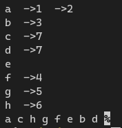

[toc]

## 1. 作业任务描述

使用非递归的方式以深度优先遍历邻接链表

## 2. 作业设计思路

利用栈的思想，将需要遍历的节点放入堆栈中，访问后删除直到栈空

## 3. 代码实现

```c++
#include <bits/stdc++.h>
#define N 8
using namespace std;

struct ArcNode
{
    int adjvex;
    struct ArcNode *nextarc;
};

struct VNode
{
    char data;
    ArcNode *first;
};

struct ALGraph
{
    VNode vertices[N];
    int vexNum = 0, arcNum = 0;
};

void InsertVex(ALGraph *g, char v)
{
    (g->vertices[g->vexNum++]).data = v;
}

void InsertArc(ALGraph *g, char v, char w)
{
    int pos = -1;
    for (int i = 0; i < g->vexNum; i++)
    {
        if (g->vertices[i].data == w)
            pos = i; // find w's position
        if (g->vertices[i].data == v)
        {
            if (pos == -1) // find w's position
            {
                for (int j = i; j < g->vexNum; j++)
                {
                    if (g->vertices[j].data == w)
                    {
                        pos = j;
                        break;
                    }
                }
            }
            if (pos == -1)
                break;

            if (g->vertices[i].first == nullptr)
            { // generate the first Node
                g->vertices[i].first = new ArcNode;
                g->vertices[i].first->adjvex = pos;
                g->vertices[i].first->nextarc = nullptr;
            }
            else
            { // already has a Node
                ArcNode *p = g->vertices[i].first;
                for (;; p = p->nextarc)
                    if (!p->nextarc)
                        break;
                p->nextarc = new ArcNode;
                p = p->nextarc;
                p->adjvex = pos;
                p->nextarc = nullptr;
            }
            g->arcNum++;
            break;
        }
    }
}

void traverse(ALGraph g, int n)
{
    int top = 0;
    int visit[n];
    int wait[n];
    memset(visit, 0, sizeof(visit));
    memset(wait, 0, sizeof(wait));
    int i = 0;
    wait[top++] = i;
    while (top)
    {
        if (visit[i] == 1)
        {
            top--;
            continue;
        }
        for (ArcNode *p = g.vertices[i].first; p; p = p->nextarc)
        {
            if (!p)
                break;
            wait[top++] = p->adjvex;
        }
        cout << g.vertices[i].data << " ";
        visit[i] = 1;
        i = wait[--top];
    }
}

void print(ALGraph g)
{
    for (int i = 0; i < g.vexNum; i++)
    {
        cout << g.vertices[i].data << " ";
        for (ArcNode *p = g.vertices[i].first; p != nullptr; p = p->nextarc)
        {
            cout << " ->" << p->adjvex << " ";
        }
        cout << endl;
    }
}

int main()
{
    ALGraph map;
    for (int i = 0; i < N; i++)
    {
        node[i] = 0;
        map.arcNum = 0;
        map.vexNum = 0;
        map.vertices[i].data = 0;
        map.vertices[i].first = nullptr;
    }

    char vexs[] = {'a', 'b', 'c', 'd', 'e', 'f', 'g', 'h'};

    for (int i = 0; i < sizeof(vexs); i++)
    {
        InsertVex(&map, vexs[i]);
    }

    InsertArc(&map, 'a', 'b');
    InsertArc(&map, 'a', 'c');
    InsertArc(&map, 'b', 'd');
    InsertArc(&map, 'c', 'h');
    InsertArc(&map, 'd', 'h');
    InsertArc(&map, 'g', 'f');
    InsertArc(&map, 'f', 'e');
    InsertArc(&map, 'h', 'g');

    print(map);

    traverse(map, 8);

    return 0;
}
```

## 4. 输入的数据及得到的结果

插入的图
$$
\begin{CD}
    d @>>> b\\
    @VVV @VVV\\
    a   \\
    @VVV @VVV\\
    c @>>>h @>>> g @>>> f @>>> e
\end{CD}
$$

遍历结果


## 5. 评估算法的复杂度

时间复杂度：$T(n) = O(n)$

空间复杂度：$S(n) = O(n)$
