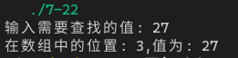

[toc]

## 1. 作业任务描述

折半查找的递归算法

## 2. 作业设计思路

利用递归将传入的数组不断拆分，当数组只有一个数字时返回比较的值

## 3. 代码实现

```c++
#include <bits/stdc++.h>

using namespace std;

int halfsearch(int tar, int a[], int beg, int end)
{
    if(beg < end)
    {
        if(a[(beg+end)/2] >= tar) return halfsearch(tar, a, beg, (beg+end)/2);
        else return halfsearch(tar, a, ((beg+end)/2)+1, end);
    }
    else
    {
        if(a[beg] == tar) return beg;
    }
    return -1;
}

int main()
{
    int arr[] = {5, 16, 20, 27, 30, 36, 44, 55, 60, 67, 71};
    int tmp, pos;
    cout << "输入需要查找的值: ";
    cin >> tmp;
    pos = halfsearch(tmp, arr, 0, 11);
    cout << "在数组中的位置: " << pos << ",值为: " <<arr[pos] << endl;
    return 0;
}
```

## 4. 输入的数据及得到的结果

输入数据：27
结果


## 5. 评估算法的复杂度

由于数据本身有序,查找时类似于遍历树,时间复杂度为：$T(n) = O(log_{2}{n})$

空间复杂度为：$S(n) = O(1)$
