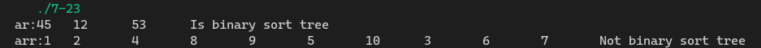

[toc]

## 1. 作业任务描述

判别二叉排序树

## 2. 作业设计思路

根据二叉排序树树的特点遍历每一个节点，满足要求则继续不满足则直接返回0

## 3. 代码实现

```c++
#include <bits/stdc++.h>

using namespace std;

struct tree
{
    int data;
    tree *lchild;
    tree *rchild;
};

int is_binary_sort_tree(tree *t)
{
    if(t->lchild == nullptr && t->rchild == nullptr) return 1;
    if(t->lchild != nullptr && t->lchild->data < t->data) return is_binary_sort_tree(t->lchild);
    else return 0;
    if(t->lchild != nullptr && t->rchild->data > t->data) return is_binary_sort_tree(t->rchild);
    else return 0;
}

void init(tree *(*node), int *arr, int n, int i = 1) // initial tree
{
    *node = new tree;
    (*node)->data = arr[i - 1];

    if (!(2 * i > n))
        init(&(*node)->lchild, arr, n, 2 * i);
    if (!(2 * i + 1 > n))
        init(&(*node)->rchild, arr, n, 2 * i + 1);
}

void print(tree *h) // preorder
{
    if (h == nullptr)
        return;
    else
    {
        printf("%d\t", h->data);
        print(h->lchild);
        print(h->rchild);
    }
}

int main()
{
    tree *t, *tt;
    int arr[] = {1, 2, 3, 4, 5, 6, 7, 8, 9, 10};
    int ar[] = {45,12,53};
    init(&t, ar, 3);
    init(&tt, arr, 10);
    cout << "ar:";
    print(t);
    if (is_binary_sort_tree(t))
        cout << "Is binary sort tree" << endl;
    else 
        cout << "Not binary sort tree" << endl;
    cout << "arr:";
    print(tt);
    if (is_binary_sort_tree(tt))
        cout << "Is binary sort tree" << endl;
    else 
        cout << "Not binary sort tree" << endl;
    return 0;
}
```

## 4. 输入的数据及得到的结果

两个数组一个是二叉排序树，另一个不是
结果


## 5. 评估算法的复杂度

判断时遍历树,时间复杂度为：$T(n) = O(n)$

空间复杂度为：$S(n) = O(1)$
