[toc]
# 课程导入日历
## 获得一个包含课程信息.ics文件

.ics文件的可以通过Github上的一个名为[ClasstableToIcal](https://github.com/SunsetYe66/ClasstableToIcal)的开源项目进行制作

当然本教程也是提供的请前往[这里下载](http://mackenia.xyz/file)

> 本人提供的课程.ics文件仅包含本专业推荐课程，不含英语、体育、扩展课，如果需要请自行制作

## 导入日历

### IOS

IOS端导入十分方便，且由于生态好，在其中一台设备中导入后便能直接在自己的其他苹果上看到。

1. 获取[.ics文件](http://mackenia.xyz/file)
> 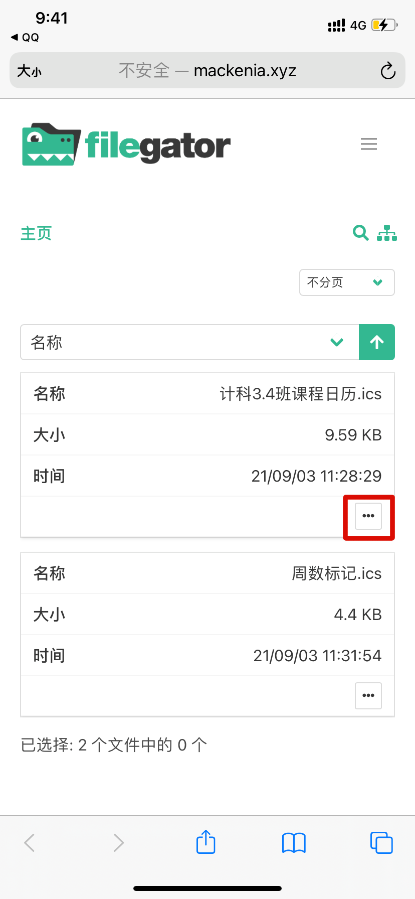
2. 点击允许即可
> 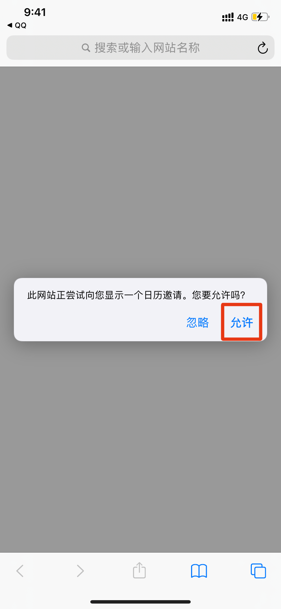

#### 效果

> 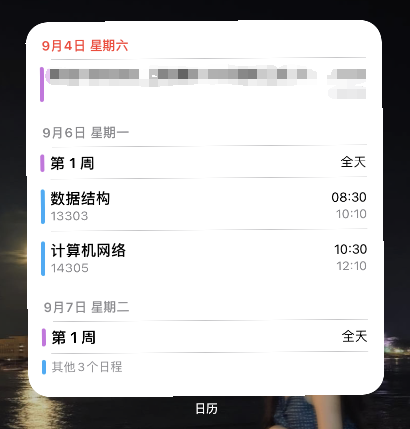
> 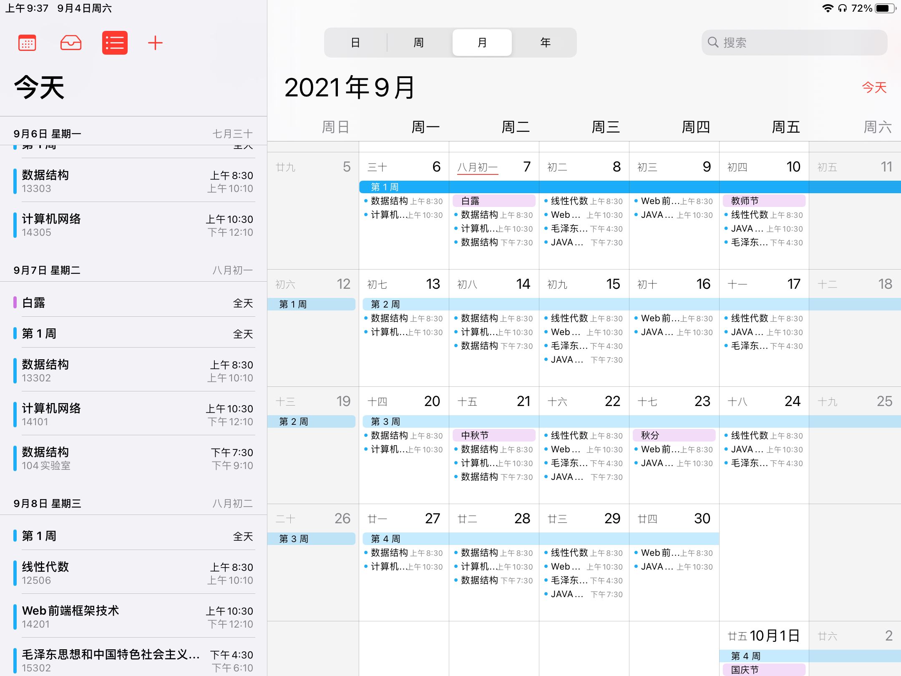

> 如需周数标记，下载周数标记文件导入即可

### Android

> 安卓相比苹果就繁琐多了,且不同的设备之间又存在差异，也只能说个大概

1. 获取[.ics文件](http://mackenia.xyz/file)
> 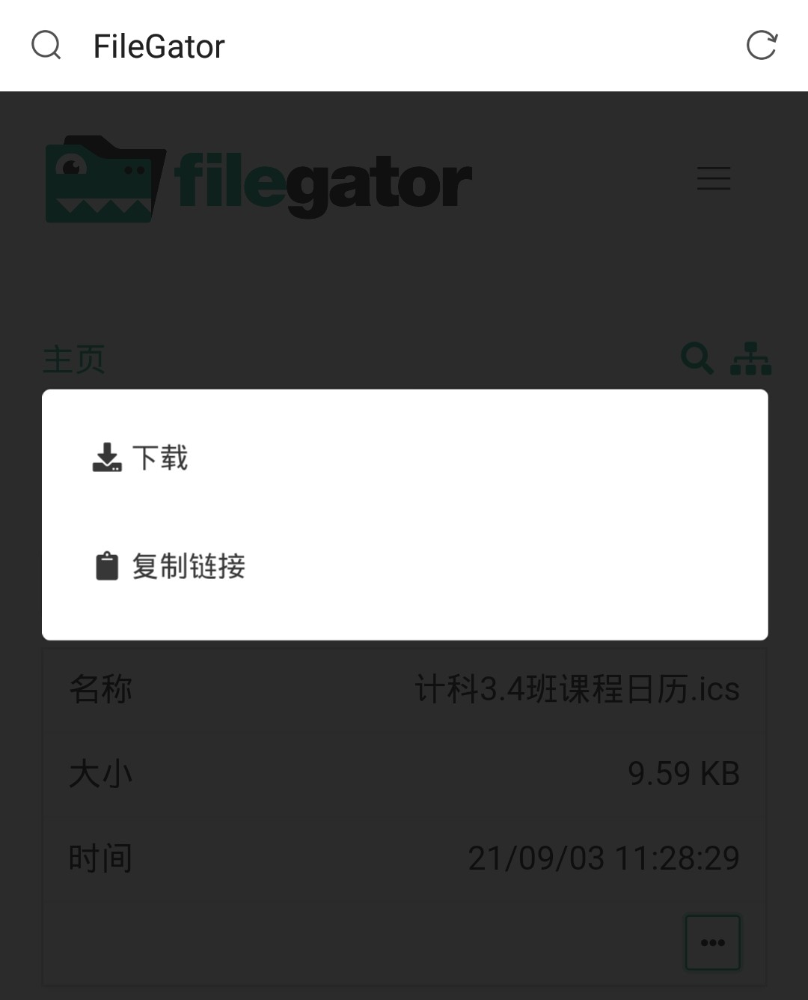
2. 打开下载记录，如果你在下载记录中能直接打开,那么直接跳到步骤4,若失败跟着步骤做
> 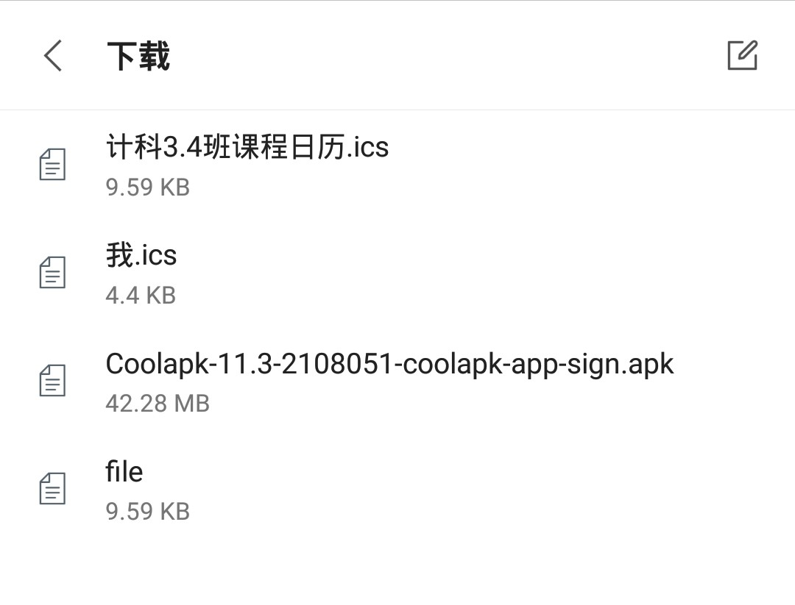
3. 打开文件管理器(我以MT文件管理器为例)，找到Download
> 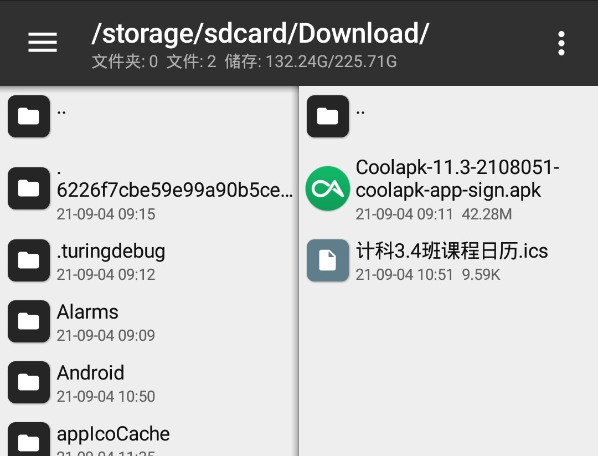
4. 点击刚刚下载的.ics文件
> 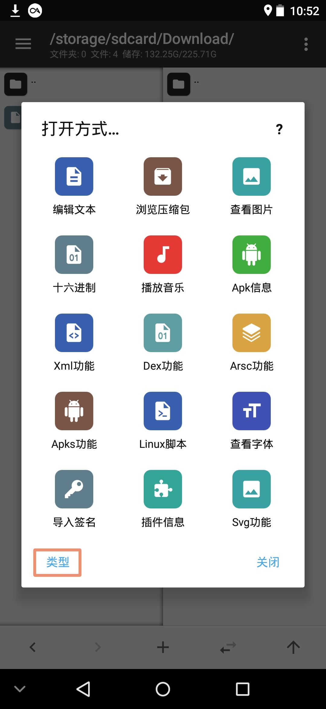
> 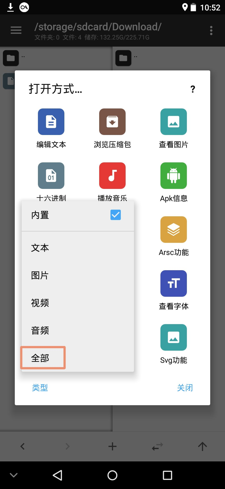
5. 打开方式选择自己的日历软件(我以锤子日历为例)
> 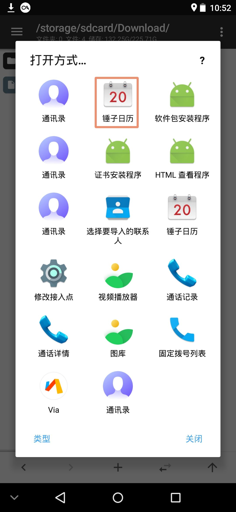
6. 点击确定即可
> 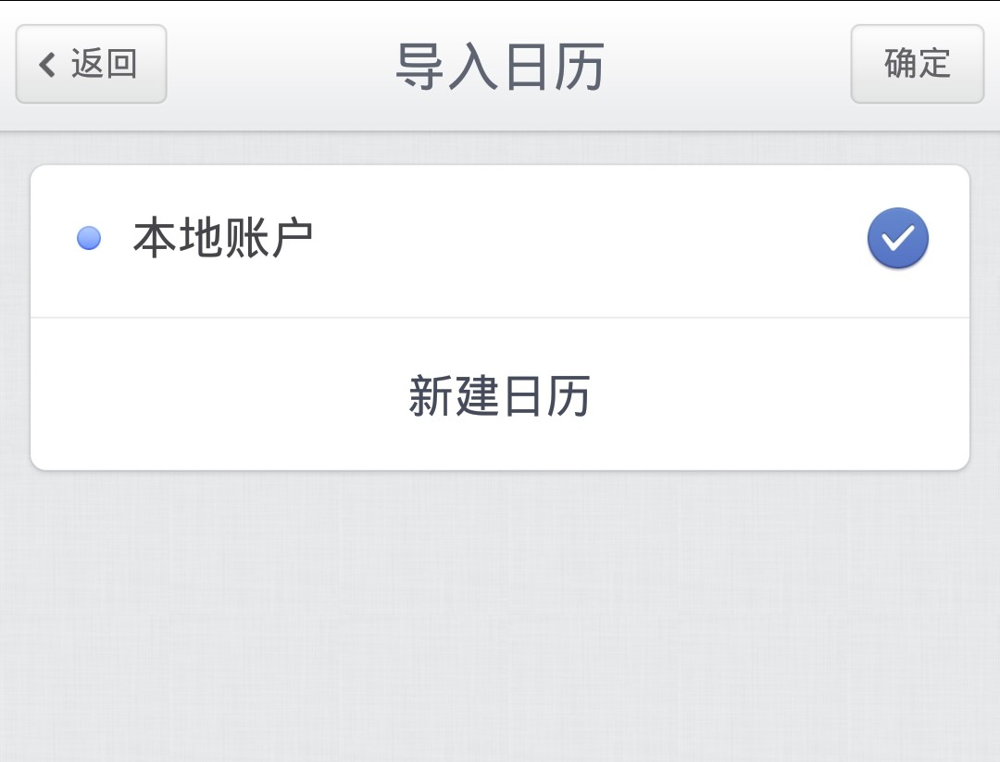

> 如需周数标记，下载周数标记文件导入即可

# 多端同步

## IOS

默认会在自己的苹果设备之间自动同步

## Android

摸了，环境太复杂了
